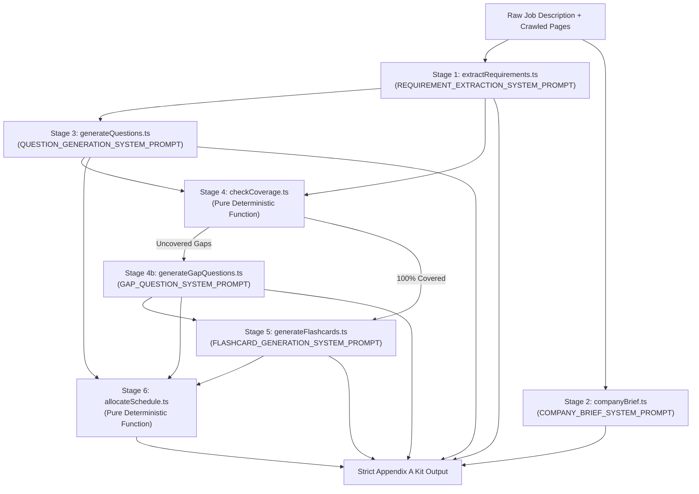

# Pilot — AI Interview Prep Kit Platform

Pilot is an end-to-end AI-powered interview preparation system designed to transform raw job descriptions, company websites, and candidate target goals into hyper-tailored, structured interview prep kits adhering strictly to the **Appendix A Specification**.

---

## 1. Project Overview & Tech Stack

### Tech Stack
- **Frontend:** Next.js 16 (React 19, Turbopack), Tailwind CSS, Lucide React icons, Canvas Confetti.
- **Backend:** Node.js, Express, TypeScript, Mongoose / MongoDB Atlas.
- **Authentication:** Firebase Authentication with bearer token verification and fallback decoding.
- **LLM Pipeline:** Google Gemini (`gemini-3.1-flash-lite`, `gemini-3.1-pro-preview`, `gemini-3.6-flash`) with structured schema output and exponential backoff retry.
- **Web Crawling & Research:** Firecrawl SDK with 3-stage link discovery (Homepage → Careers → Specific Job Opening).

### Stack Justification
- **TypeScript End-to-End:** Enforces strict Appendix A schema compliance across both pipeline generation and UI client render layers.
- **Pure Deterministic Pipeline Stages:** Coverage checking and study schedule allocation are decoupled from LLMs as pure functions, guaranteeing 100% predictable schedule day limits and traceable coverage audits.
- **MongoDB Atlas + Local Persistence:** Bi-directional sync guarantees zero UI lag (0ms optimistic updates via `localStorage`) and cloud persistence.

---

## 2. High-Level Architecture & Pipeline Stages



### Modular Stage Responsibilities:
1. **Stage 1 (`extractRequirements.ts`):** Parses competencies into structured items (`id`, `text`, `kind`, `priority`).
   - Prioritizes `"must"` for core requirements and experience markers (`"3+ years"`, `"strong proficiency"`).
   - Reserves `"nice"` exclusively for optional markers (`"plus"`, `"bonus"`, `"preferred"`).
2. **Stage 2 (`companyBrief.ts`):** Summarizes product, engineering culture, and interview signals grounded in scraped pages.
3. **Stage 3 (`generateQuestions.ts`):** Generates questions across 4 categories (`technical`, `behavioural`, `system-design`, `company-fit`) linked to specific requirement IDs.
4. **Stage 4 (`checkCoverage.ts`):** Deterministic set comparison. Pinpoints uncovered requirement IDs.
5. **Stage 4b (`generateGapQuestions.ts`):** Generates targeted questions for any uncovered requirement.
6. **Stage 5 (`generateFlashcards.ts`):** Generates active recall flashcards mapped to requirements.
7. **Stage 6 (`allocateSchedule.ts`):** Deterministically maps questions across requested days ($N$ days = $N$ items, integer minutes).

---

## 3. Appendix A Schema Structure

Every prep kit strictly adheres to the Appendix A contract:
```json
{
  "source": {
    "company": "Vercel",
    "company_url": "https://vercel.com",
    "role": "Senior Frontend Engineer",
    "location": "Remote",
    "jd_chars": 2340,
    "researched_at": "2026-09-23T10:00:00.000Z",
    "pages_used": ["https://vercel.com", "https://vercel.com/careers"]
  },
  "company_brief": {
    "summary": "Vercel provides frontend cloud infrastructure and Next.js development platform.",
    "what_they_do": "Frontend deployment, edge infrastructure, developer workflows.",
    "sources": ["https://vercel.com"]
  },
  "role": {
    "title": "Senior Frontend Engineer",
    "seniority": "Senior",
    "responsibilities": ["Build performant React components", "Architect edge rendering pipelines"],
    "requirements": [
      { "id": "r1", "text": "5+ years React and TypeScript", "kind": "technical", "priority": "must" }
    ]
  },
  "questions": [
    {
      "id": "q1",
      "requirement_ids": ["r1"],
      "category": "technical",
      "prompt": "How do you optimize React Server Component hydration bottlenecks?",
      "answer_outline": "1. Clarify constraints... 2. Architecture... 3. Trade-offs...",
      "difficulty": 3
    }
  ],
  "flashcards": [
    {
      "id": "f1",
      "front": "What is selective hydration in React 18+?",
      "back": "Streaming HTML with Suspense boundaries to prioritize interactive components.",
      "requirement_ids": ["r1"]
    }
  ],
  "schedule": {
    "days_available": 5,
    "days": [
      { "day": 1, "focus": "Foundations & Core Architecture", "question_ids": ["q1"], "minutes": 45 }
    ]
  },
  "coverage": {
    "uncovered_requirement_ids": [],
    "passes": 2
  }
}
```

---

## 4. Setup & Running Instructions

### Prerequisites
- Node.js 20+
- MongoDB instance (or Atlas cluster)
- Gemini API Key (`GEMINI_API_KEY`)
- Optional Firecrawl Key (`FIRECRAWL_API_KEY`)

### Environment Configuration
Copy `.env.example` to `.env` in `Backend/`:
```env
PORT=4000
MONGODB_URI=mongodb://localhost:27017/pilot
GEMINI_API_KEY=your_gemini_api_key
FIRECRAWL_API_KEY=your_firecrawl_api_key
```

### Running Locally
```bash
# 1. Start Backend Dev Server (port 4000)
cd Backend
npm install
npm run dev

# 2. Start Frontend Dev Server (port 3000)
cd ../Frontend/pilot-frontend
npm install
npm run dev
```

### Running Automated Tests
```bash
cd Backend
npm test
```

### Running Appendix B Batch Evaluation CLI
```bash
cd Backend
npm run evaluate -- --input fixtures/sample-cases.json --output fixtures/output-evaluation-report.json
```

---

## 5. Creative Feature: Interactive Active Recall Simulator & GitHub Activity Matrix

1. **GitHub Activity-Style Question Grid:**
   - Visual square indicator matrix on top of the interactive questions view.
   - Visually indicates practiced, current, and unvisited questions with instant jumping.
2. **Confidence-Scored Flashcard Practice Mode:**
   - 3D flip card with spaced repetition confidence ratings:
     - 🔴 **Hard / Again** (Rating 1 — prioritized in review queue)
     - 🟡 **Good** (Rating 2)
     - 🟢 **Mastered** (Rating 3)
   - Real-time Weak-Card filter mode.
3. **Bi-Directional Cloud & Offline Sync:**
   - Progress instantly saved to `localStorage` (0ms lag) and debounced-synced to MongoDB Atlas.

---

## 6. Key Design Decisions & Known Trade-offs

- **Deterministic Stage Decoupling:** We explicitly chose not to combine coverage analysis and scheduling into LLM generation. Pure TypeScript functions ensure $O(1)$ reliability and strict schema conformity without prompt drift.
- **Failover LLM Engine:** Uses `gemini-3.1-flash-lite` for ultra-fast generation with automatic failover to `gemini-3.1-pro-preview` and exponential backoff retry for 429 quota resilience.
- **Link Discovery vs Hardcoding:** Scrapes full sitemap links and uses relevance scoring to discover career URLs dynamically rather than guessing static `/careers` paths.
