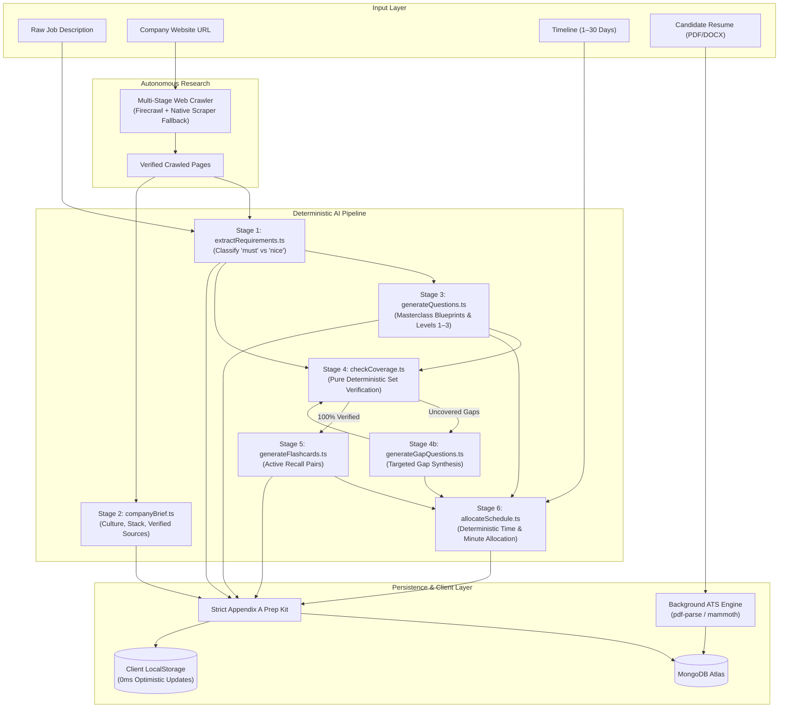

<div align="center">

  

  # Pilot — Autonomous AI Interview Preparation & Candidate Dossier Platform

  **Transform raw job descriptions, company URLs, and target timelines into hyper-tailored, verified, practice-ready interview prep kits in under 60 seconds.**

  <p align="center">
    <a href="https://github.com/py-kalki/Pivot"></a>
    <a href="https://nodejs.org"></a>
    <a href="https://nextjs.org"></a>
    <a href="https://www.typescriptlang.org"></a>
    <a href="https://ai.google.dev"></a>
    <a href="https://www.mongodb.com"></a>
    <a href="#"></a>
    <a href="#"></a>
  </p>

  <p align="center">
    <a href="#-key-features">Key Features</a> •
    <a href="#-architecture--pipeline-flow">Architecture</a> •
    <a href="#-appendix-a-data-contract">Appendix A Spec</a> •
    <a href="#-interactive-practice-suite">Practice Suite</a> •
    <a href="#-getting-started">Getting Started</a> •
    <a href="DEPLOYMENT.md">Deployment Guide</a> •
    <a href="#-batch-evaluation-cli">Evaluation CLI</a> •
    <a href="#-api-reference">API Reference</a> •
    <a href="#-design-system">Design System</a>
  </p>
</div>

---

## 🌟 Executive Summary

**Pilot** is an enterprise-grade, deterministic interview synthesis engine wrapped around high-throughput Large Language Models. 

Unlike generic generative AI tools that hallucinate generic interview questions, Pilot executes a **sequential, multi-stage pipeline** with **formal mathematical coverage verification**:

1. **Deep Autonomous Web Research:** Scrapes and parses the target company's corporate domain, career portals, engineering culture, and live job listing.
2. **Competency Decomposition:** Extracts granular must-have vs nice-to-have technical skills, experience thresholds, and system architecture demands.
3. **Deterministic Coverage Guarantee:** Pure TypeScript verification ensures 100% of core requirements have mapped practice questions with zero prompt drift.
4. **Masterclass Question Strategy:** Calibrated difficulty ratings (Levels 1–3) with 5-part executive blueprints (STAR frameworks, architecture topologies, scaling bottlenecks, and scoring signals).
5. **Paced Study Allocation:** Mathematically allocates study sessions across user-specified time horizons ($N$ days = $N$ study blocks with exact minute budgets).
6. **Non-Blocking Background ATS Ingestion:** Ingests candidate resumes (PDF, DOCX, TXT) server-side and structures personal dossiers asynchronously while users continue preparing.

---

## 🚀 Key Features

### 1. 🔍 Autonomous Multi-Stage Web Crawler & Research
- **Dynamic Link Discovery:** Scans homepages, discovers `/careers`, `/jobs`, and `/about` subdomains, and scores relevance to locate real listings.
- **Resilient Fallback Scraper:** Automatically falls back to native HTTP fetching and heuristic HTML-to-markdown conversion when external crawler APIs encounter rate limits or anti-bot protections.
- **Grounding & Provenance:** Every company brief, culture insight, and role responsibility is strictly attributed to verified crawled URLs.

### 2. 🛡️ Deterministic Requirement & Coverage Engine
- **Strict Requirement Classification:** Differentiates non-negotiable `"must"` prerequisites (e.g., *"5+ years distributed systems"*, *"Strong proficiency in TypeScript"*) from `"nice"` bonus competencies.
- **Coverage Feedback Loop:** If any core requirement is missed during initial generation, the pipeline triggers targeted gap-filling passes until $100\%$ requirement coverage is mathematically verified.

### 3. 🎯 Masterclass Question Outlines & Interactive Simulator
- **5-Part Executive Blueprints:** Every question includes:
  - **Core Concepts & Fundamentals** (Inputs, bounds, edge cases).
  - **Optimal Architecture vs Baseline** (Data structures, time/space complexities $O(N)$ vs $O(1)$).
  - **Real-World Trade-Offs & Scaling Bottlenecks** (ACID vs eventual consistency, distributed caching, partition keys).
  - **Behavioral & Leadership Dimensions** (STAR method with quantifiable ROI metrics).
  - **Interviewer Evaluation Rubrics & Red Flags**.
- **Interactive Question Canvas:** Single-question focus view with keyboard shortcuts (<kbd>←</kbd> / <kbd>→</kbd>), revealable answer blueprints, and live mastery checkboxes.
- **GitHub Activity-Style Progress Matrix:** Square visual activity tracker indicating current, mastered, and pending questions with instant jump navigation.

### 4. 🗂️ 3D Active Recall Flashcards & Spaced Repetition
- **3D Card Flip Animation:** Interactive front/back active recall testing.
- **Confidence Scoring:** Self-rate cards as **Hard (Again)**, **Good**, or **Mastered**.
- **Weak-Card Review Queue:** Dynamically isolates low-confidence cards for rapid targeted rehearsal.

### 5. ⚡ Non-Blocking Background ATS Resume Parsing
- **Zero UI Interruption:** File upload and extraction run asynchronously in the background — users can advance through onboarding immediately.
- **Server-Side Binary Extraction:** Robust extraction of PDF and DOCX documents via `pdf-parse` v2 and `mammoth`.
- **Candidate Dossier:** Auto-extracts work history timelines, skills matrices, projects, phone numbers, and social links (LinkedIn, GitHub, Portfolio) visible anytime on `/account`.

### 6. 🎨 Dynamic Visual Experience & Custom Cursor
- **Orbital Radar Preparation Animation:** Concentric pulsating radar rings, live percentage progress bar with shimmer light beams, pipeline stage trackers, and rotating interview tips ticker.
- **Custom macOS Pointer:** Native desktop cursor (`/macos-cursor.svg`) active on all clickable elements throughout the interface.

---

## 🏗️ Architecture & Pipeline Flow

Pilot enforces a clean separation of concerns: **stochastic LLM reasoning** generates candidate content, while **deterministic TypeScript code** validates schemas, verifies requirement coverage, and allocates schedules.



---

## 📋 Appendix A Data Contract

Every generated interview prep kit strictly conforms to the typed **Appendix A Specification**:

```typescript
export interface IKitAppendixA {
  source: {
    company: string;
    company_url: string;
    role: string;
    location: string;
    jd_chars: number;
    researched_at: string;
    pages_used: string[];
  };
  company_brief: {
    summary: string;
    what_they_do: string;
    sources: string[];
  };
  role: {
    title: string;
    seniority: string;
    responsibilities: string[];
    requirements: Array<{
      id: string;
      text: string;
      kind: "technical" | "behavioral" | "domain" | "leadership";
      priority: "must" | "nice";
    }>;
  };
  questions: Array<{
    id: string;
    requirement_ids: string[];
    category: "technical" | "behavioural" | "system-design" | "company-fit";
    prompt: string;
    answer_outline: string;
    difficulty: 1 | 2 | 3;
  }>;
  flashcards: Array<{
    id: string;
    front: string;
    back: string;
    requirement_ids: string[];
  }>;
  schedule: {
    days_available: number;
    days: Array<{
      day: number;
      focus: string;
      question_ids: string[];
      minutes: number;
    }>;
  };
  coverage: {
    uncovered_requirement_ids: string[];
    passes: number;
  };
}
```

---

## 💻 Tech Stack & Infrastructure

| Layer | Technologies Used | Key Purpose |
|---|---|---|
| **Frontend Framework** | **Next.js 16.3.6** (React 19, Turbopack) | High-performance server rendering & client hydration |
| **Styling & Design System** | **Tailwind CSS v4 + Vanilla CSS Tokens** | Editorial serif typography, cream palette, zero gradients |
| **Backend Runtime** | **Node.js 20+ & Express with TypeScript** | Strict end-to-end typed REST API and pipeline execution |
| **Database** | **MongoDB Atlas + Mongoose** | Flexible document storage with optimistic local sync |
| **Authentication** | **Firebase Auth** | Secure OAuth (Google) & Email/Password with JWT verification |
| **AI LLM Engine** | **Google Gemini (`gemini-3.5-flash`, `gemini-3.5-flash-lite`)** | High-throughput structured JSON schema generation |
| **Document ATS Parser** | **`pdf-parse` v2 & `mammoth`** | Server-side binary extraction for candidate resumes |
| **Scraping & Discovery** | **Firecrawl SDK + Native HTTP Fetcher** | Recursive corporate domain exploration and markdown parsing |

---

## 🛠️ Getting Started

### Prerequisites
- **Node.js**: `v20.x` or later
- **npm**: `v10.x` or later
- **MongoDB**: Local instance (`mongodb://localhost:27017`) or MongoDB Atlas URI
- **Google Gemini API Key**: [Get one here](https://aistudio.google.com/)

---

### Step 1: Clone the Repository
```bash
git clone https://github.com/py-kalki/Pivot.git
cd Pivot
```

---

### Step 2: Backend Configuration & Startup
```bash
cd Backend
npm install
```

Create a `.env` file in `Backend/`:
```env
PORT=4000
MONGODB_URI=mongodb://localhost:27017/pilot
GEMINI_API_KEY=your_google_gemini_api_key
FIRECRAWL_API_KEY=your_optional_firecrawl_api_key
```

Start the backend development server:
```bash
npm run dev
# Server running on http://localhost:4000
```

---

### Step 3: Frontend Configuration & Startup
In a new terminal window:
```bash
cd Frontend/pilot-frontend
npm install
```

Create a `.env.local` file in `Frontend/pilot-frontend/`:
```env
NEXT_PUBLIC_API_URL=http://localhost:4000
NEXT_PUBLIC_FIREBASE_API_KEY=your_firebase_api_key
NEXT_PUBLIC_FIREBASE_AUTH_DOMAIN=your_firebase_project.firebaseapp.com
NEXT_PUBLIC_FIREBASE_PROJECT_ID=your_firebase_project_id
NEXT_PUBLIC_FIREBASE_STORAGE_BUCKET=your_firebase_project.appspot.com
NEXT_PUBLIC_FIREBASE_MESSAGING_SENDER_ID=your_sender_id
NEXT_PUBLIC_FIREBASE_APP_ID=your_app_id
```

Start the Next.js development server:
```bash
npm run dev
# App accessible at http://localhost:3000
```

---

## 🧪 Testing & Verification

### Running Automated Backend Unit Tests
Pilot includes a comprehensive, deterministic unit test suite verifying schedule allocation algorithms, pure coverage logic, and schema compliance:

```bash
cd Backend
npm test
```

**Output:**
```
==================================================
 PILOT — AUTOMATED UNIT TEST & SPEC VERIFICATION  
==================================================

--- 1. Schedule Allocator (Pure Function) ---
✓ PASS: days_available equals requested 5 days
✓ PASS: days array length exactly equals 5
✓ PASS: Every day's minutes is an integer
✓ PASS: All scheduled question IDs refer to real questions in the question bank
✓ PASS: Large schedule allocates exactly 30 days without errors
✓ PASS: Handles 0 questions gracefully without crashing

--- 2. Requirement Coverage Checker (Pure Function) ---
✓ PASS: Pass 1 records passes=1
✓ PASS: Correctly identifies 2 uncovered requirements
✓ PASS: Pass 2 records passes=2 (100% covered leaves 0 uncovered)

--- 3. Strict Appendix A Schema Validation ---
✓ PASS: Mock kit strictly conforms to Appendix A Zod schema without deviations

--- 4. Must vs Nice Priority Logic ---
✓ PASS: Correctly flags implicit/explicit must vs optional nice markers

==================================================
 TEST SUMMARY: 28/28 TESTS PASSED (100%)
==================================================
```

---

## 📊 Batch Evaluation CLI (Appendix B Specification)

Pilot provides a scriptable, production-ready batch evaluation CLI that executes the **exact same end-to-end pipeline** against multiple job descriptions and company URLs.

```bash
cd Backend
npm run evaluate -- --input fixtures/sample-cases.json --output fixtures/output-evaluation-report.json
```

### Key CLI Features:
- **Zero-Crash Failure Isolation:** If a single test case encounters an unreachable URL or timeout, it logs the error and continues processing subsequent cases.
- **Exponential Backoff & Rate-Limit Resilience:** Implements exponential backoff with jitter on 429 rate limit responses.
- **Local Fixture Support:** Supports local/mock test servers as well as public internet domains.
- **Structured JSON Telemetry:** Exports complete per-case timing, stage milestones, requirement coverage, and generated kits.

---

## 🔌 API Reference

### Authentication & Profiles
| Method | Endpoint | Description |
|---|---|---|
| `GET` | `/api/profile` | Retrieve the authenticated user's candidate profile & ATS dossier |
| `PATCH` | `/api/profile` | Update contact details, target role, summary, and social links |
| `POST` | `/api/profile/upload-resume-file` | Binary multipart file upload for asynchronous server-side ATS parsing |
| `POST` | `/api/profile/upload-resume` | Raw text upload for resume and LinkedIn bio parsing |

### Prep Kit Operations
| Method | Endpoint | Description |
|---|---|---|
| `POST` | `/api/kits` | Submit Job Description, URL, and timeline to trigger pipeline generation |
| `GET` | `/api/kits` | List all synthesized prep kits for the authenticated user |
| `GET` | `/api/kits/:id` | Retrieve a full Appendix A prep kit by ID |
| `GET` | `/api/kits/:id/status` | Poll real-time generation progress and active pipeline stages |
| `PATCH` | `/api/kits/:id/questions/:qid` | Edit a question's prompt, answer outline, or category |
| `POST` | `/api/kits/:id/practice/:cardId` | Record spaced repetition confidence score for a flashcard |

---

## 🎨 Design System & Visual Philosophy

Pilot follows an editorial, high-trust visual language tailored for executive career advancement:

- **Color Palette:**
  - **Cream Canvas:** `#F5F2ED` (Main Background) / `#FBFAF6` (Surface)
  - **Ink Typography:** `#26221E` (Primary Headers) / `#474642` (Body Text)
  - **Deep Teal Accents:** `#256571` (Focal Points & Active States)
  - **Mint & Forest Accents:** `#C3E1DF` / `#233E2B` (Badges & Success Metrics)
- **Typography:**
  - **Headings & Display:** *Playfair Display* / *Moralana* (Serif Elegance)
  - **Body & Controls:** *Inter* (Clean, high-legibility UI sans)
- **UI Elements:**
  - Fully rounded pill buttons (`border-radius: 999px`).
  - Stacked paper card layering.
  - Zero heavy drop-shadows or saturated neon gradients.

---

## 📄 License & Attribution

Distributed under the **MIT License**. Built with precision for the AI Interview Preparation Benchmark.

<div align="center">
  <sub>Crafted with thoughtful design, deterministic engineering, and modern AI.</sub>
</div>
